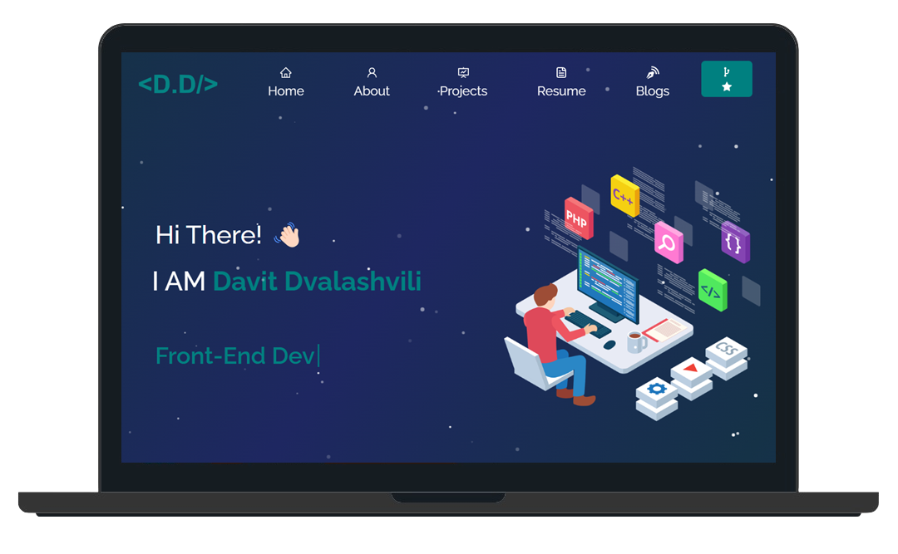

# My Portfolio

### Table of Contents

- [Prerequisites](#Prerequisites)
- [Tech Stack](#Tech-Stack)
- [Screenshot](#Screenshot)
- [Getting Started](#Getting-Started)
- [Build with](#Build-With)
- [Deployment](#Deployment)
- [Author](#Author)

### Prerequisites

-  _npm @8 and up_
-  \_vite @4.0.0

#

### Tech Stack

-  _ReactJS @18.1.0 - frontend framework_
-  \_Styled-components @5.3.9 - visual primitives for the component age

### Screenshot



### Links

- Solution URL: [Add solution URL here](https://github.com/DavitDvalashvili/My-Portfolio)
- Live Site URL: [Add live site URL here](https://my-portfolio-ten-indol.vercel.app/)

### Getting Started

1. First of all you need to clone app repository from github:

```
git clone https://github.com/DavitDvalashvili/My-Portfolio.git
```

2. Next step requires install all the dependencies.

```
npm install
```

3. To see project in action

```
npm run dev
```

# Build-with

- React Javascript library;
- Styled Components for styling;
- bootstrap;
- Vite;

```

### Deployment

Before every deployment you need to create build file.

```

npm run build

```

after this you can use this file to deploy project on server.

```

### Author

- Github profile - [Add your name here](https://github.com/DavitDvalashvili)
- Linkedin profile - [Add your name here](https://www.linkedin.com/in/davit-dvalashvili-0421b6253)
- Email - [@your_username](davitdvalashvili1996@gmail.com)

```

```
